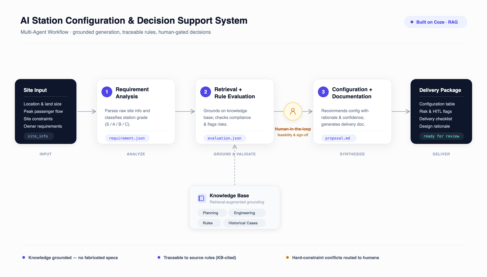

# AI Station Configuration & Decision Support System

**English** | [中文](README.zh-CN.md)

> Turning fragmented transit-planning expertise into a **grounded, auditable, human-gated AI workflow** — a multi-agent system that configures autonomous-transit stations and knows when to defer to a human.

**Role:** AI Product Manager (end-to-end: problem → agent design → knowledge engineering → evaluation)
**Platform:** Coze (multi-agent orchestration) + RAG knowledge base · **Model:** Doubao 2.0 Pro
**Pattern:** 3-agent pipeline with a human-in-the-loop checkpoint

<p align="center">
  
</p>

---

## TL;DR

Station configuration knowledge at an autonomous-transit company lived in senior designers' heads and scattered documents — inconsistent standards, slow iteration. I turned it into a 3-agent AI pipeline that reads a site brief, checks it against a grounded knowledge base, and drafts a delivery document — **flagging any decision that must stay human**. Along the way I diagnosed and fixed a real RAG hallucination problem, which became the most instructive part of the build.

---

## 1. Problem

An autonomous public-transit company designs stations for three teams — **Operations, Engineering, Urban Design** — who each use different standards. The result:

- Knowledge is fragmented across people and documents
- Rules are interpreted manually, inconsistently
- Proposals iterate slowly; quality depends on which senior designer is available

## 2. AI Opportunity

> Not "build a chatbot." The real opportunity: **encode domain knowledge as an executable, auditable workflow.**

So the design centered on three things: **knowledge engineering**, **agent orchestration**, and the **AI-vs-human boundary**.

## 3. Solution — A 3-Agent Pipeline

```
Site brief
  → [1] Requirement Analysis   → structured requirement (JSON)
  → [2] Retrieval + Rule Eval  → grounded compliance + risks (JSON)   [Knowledge Base / RAG]
  → ── Human-in-the-loop ──
  → [3] Configuration + Docs   → delivery document (Markdown)
```

| Agent | Job | Output |
|---|---|---|
| **1 · Requirement Analysis** | Parse the site brief, classify station grade (S/A/B/C) | `requirement.json` |
| **2 · Retrieval + Rule Evaluation** | Retrieve from the knowledge base, check compliance, flag risks — **KB-grounded, no fabrication** | `evaluation.json` |
| **3 · Configuration + Documentation** | Recommend config (value + basis + confidence), generate the delivery doc & checklist | `proposal.md` |

> Built as a deterministic pipeline rather than free autonomous hand-off — **controllability and evaluability** matter more than autonomy in an enterprise setting, and errors are easy to localize to a single agent.

## 4. Knowledge Engineering

Four curated documents ([`knowledge_base/`](knowledge_base/)) with a hierarchical structure so retrieval can cite the source section:

- `KB_01` Planning Guidelines · `KB_02` Engineering Standards · `KB_03` Station Rules · `KB_04` Historical Cases

Agent 2's retrieval is **auto-called** on every turn, hybrid search, low match threshold, reranked — so grounding is enforced, not optional.

## 5. Human-in-the-Loop

Three things are always routed back to a human: **final configuration, engineering feasibility, business/budget decisions.** The pipeline surfaces these explicitly at the top of the delivery doc rather than deciding them.

## 6. Demo — Two Test Cases

Full outputs in [`results/sample-runs.md`](results/sample-runs.md).

| Case | Input | What the system did |
|---|---|---|
| **TC1 · Greenfield** (soft) | 500 pax/h, low-lying, "B-grade" | **Cross-rule reasoning:** by flow it's B-grade, but B-grade's parking cap (2) can't serve 500 pax/h → **recommends upgrading to A-grade.** Grounded in KB, retrieved the analogous Riverside case. |
| **TC2 · Central Hub** (hard) ⭐ | 1,800 pax/h, platform on a 27m-radius curve | **Hard-constraint catch:** radius 27m < 30m → *"not implementable."* Severity high, correct fix ("re-align to ≥30m"), and it surfaced a 28m→35m precedent — then **deferred to a human.** |

TC2 is the thesis in one screen: **the AI recognizes an infeasible plan and stops, instead of confidently hallucinating a solution.**

## 7. Evaluation

Five dimensions × grounded test cases — full rubric and scores in [`03_Evaluation.md`](03_Evaluation.md).
Dimensions: Recommendation Accuracy · Rule Compliance · Risk Identification · Document Quality · Human-in-the-Loop.

## 8. The RAG Problem I Solved (the most instructive part)

The first version of Agent 2 *looked* authoritative but was **hallucinating** — citing real-sounding national standards (GB/T, CJJ) and an invented case study, none of which were in the knowledge base.

- **Diagnosis:** citations didn't map to the KB and the "similar case" was fabricated → retrieval wasn't actually grounding.
- **Fix:** set retrieval to **auto-call**, dropped the match threshold to 0.15, raised recall to 10; and hardened the prompt to *only* cite the KB, forbid external standards, and write **"not covered by knowledge base"** when it couldn't find a basis.
- **Result:** every citation returned to `KB_0x`, honest "not covered" flags appeared, and all four KB documents contributed.

> **Product takeaway:** for a RAG product, the core metric isn't "can it answer" — it's **"will it admit when it doesn't know."** Trustworthiness beats completeness.

## 9. Roadmap

- **V1** ✅ Knowledge base + grounded single-agent report
- **V2** ✅ Multi-agent workflow + rule validation + configuration recommendation *(this repo)*
- **V3** GIS/CAD ingestion, demand prediction, site simulation
- **V4** Optimization engine, automated iteration

## 10. Repository Structure

```
├── README.md                     ← this case study
├── 00_Build_Playbook.md          how it was built on Coze, step by step
├── 01_Input_Sample.md            test-case inputs
├── 02_Agent_Prompts.md           the 3 agents' system prompts
├── 03_Evaluation.md              rubric + real measured results
├── 04_Demo_Script.md             5-minute demo narration + Q&A
├── knowledge_base/               KB_01–04 (the RAG source docs)
├── results/sample-runs.md        real TC1 / TC2 outputs
└── assets/                       architecture diagram (svg / png / pdf, + dark & theme-adaptive)
```

## 11. Reproduce It

Everything needed to rebuild the bot on Coze is here: upload `knowledge_base/` as a knowledge base, create a 3-agent workflow, paste the prompts from `02_Agent_Prompts.md`, wire the knowledge base to Agent 2, and test with `01_Input_Sample.md`. Full walkthrough in [`00_Build_Playbook.md`](00_Build_Playbook.md).

---

*Résumé line:* Transformed complex transit-planning knowledge into standardized, AI-executable workflows — enabling reusable, auditable station-configuration capability across operations, engineering, and design teams.

*Note: knowledge-base content and agent prompts are in Chinese (built on Coze); this README and the case narrative are in English. Demo numbers are illustrative.*
